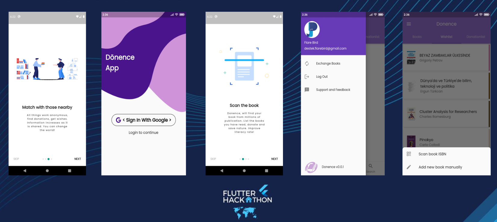
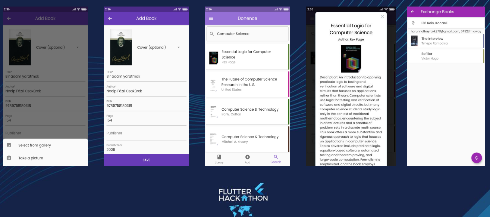
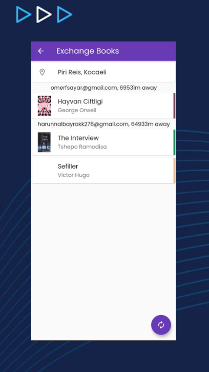

# flutter-hackathon-2021

## donence_app

## Ekip Bilgileri

- [Halil İbrahim İlhan](https://www.linkedin.com/in/hiilhan/)
- [Fatih Kaan Salgır](https://www.linkedin.com/in/fatih-kaan-salgir/)
- [Harun Albayrak](https://www.linkedin.com/in/harunalbayrak/)
- [Ömer Faruk Sayar](https://www.linkedin.com/in/omer-faruk-sayar/)

### Proje Fikri

Dönence, insanların okumak istedikleri kitaplara takas veya bağış yoluyla ücretsiz bir şekilde erişmelerine olanak sağlayan bir mobil uygulamadır.Kullanıcılar kütüphanelerine okudukları kitapları, ISBN kodunu taratarak veya form ile ekleyerek okudukları tüm kitapların listesini tutabilir, bağışlamak veya takas etmek istedikleri kitapları bağış/takas listelerine ekleyebilir, okumak istedikleri kitapları da arama bölümünden seçerek istek listelerini oluşturabilirler. Uygulama kullanıcıların listelerini karşılaştırarak takasa/bağışa uygun kullanıcıları mesafe kriterlerine göre listeler, kullanıcı listeden istediği kullanıcıyı seçebilir.

Dönence, sürdürülebilir kalkınma için küresel amaçlardan madde 4 Nitelikli Eğitimin 4.6 numaralı (2030’a kadar bütün gençlerin ve hem kadın hem de erkek olmak üzere yetişkinlerin büyük bir bölümünün okuryazar olmasını) hedefine ulaşılmasında katkıda bulunur.

